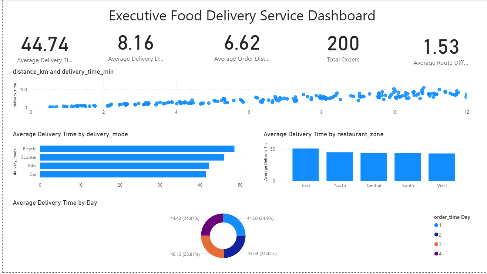

# Food Delivery Route & Operational Efficiency Analysis

## 📌 Project Overview

This project focuses on analysing food delivery routes and operational efficiency using Power BI. It explores the relationship between delivery time, route distance, traffic conditions, weather, delivery modes, restaurant zones, customer zones, and order time to identify factors associated with delivery performance and potential operational improvements.

## 🎯 Project Objectives

* Analyse average food delivery time and delivery distance.
* Understand the relationship between delivery distance and delivery time.
* Compare delivery performance across traffic and weather conditions.
* Evaluate delivery efficiency across different delivery modes.
* Analyse delivery times by restaurant and customer zones.
* Identify opportunities to improve route planning and delivery operations.

## 📊 Dashboard Visualizations

The dashboard includes the following seven visualizations:

1. Average Delivery Time by Traffic Level
2. Distance vs Delivery Time
3. Average Delivery Time by Weather
4. Average Delivery Time by Delivery Mode
5. Average Delivery Time by Restaurant Zone
6. Average Delivery Time by Customer Zone
7. Average Delivery Time by Order Time

## 📈 Key Performance Indicators (KPIs)

* Average Delivery Time
* Average Delivery Distance
* Average Order Distance
* Total Orders
* Average Route Difference

## 🛠️ Tools & Technologies

* **Power BI Desktop** – Dashboard development and data visualization
* **DAX** – KPI calculations and measures
* **Microsoft Excel / CSV** – Dataset handling and exploration
* **GitHub** – Project version control and documentation

## 📂 Repository Structure

```text
Food-Delivery-Route-Operational-Efficiency-Analysis/
│
├── .gitignore
├── DAX_Calculations.docx
├── Executive_Food_Delivery_Service_Dashboard.png
├── FDROEA1.pbix
├── Food_Delivery_Route_Efficiency_Dataset.csv
├── Recommendation_Justification.docx
└── README.md
```

## 📷 Dashboard Preview



## 📄 Project Documentation

* **DAX_Calculations.docx:** Contains the DAX measures used to calculate the dashboard KPIs.
* **Recommendation_Justification.docx:** Explains the observations, business insights, and recommendations derived from the visualizations.

## 💡 Business Value

This analysis helps identify delivery performance patterns across different operational conditions. The findings can support data-driven decisions related to route planning, delivery operations, and service efficiency.

## 👨‍💻 Author

**Yash Srivastava**

MCA – Data Science | Aspiring Data Analyst


